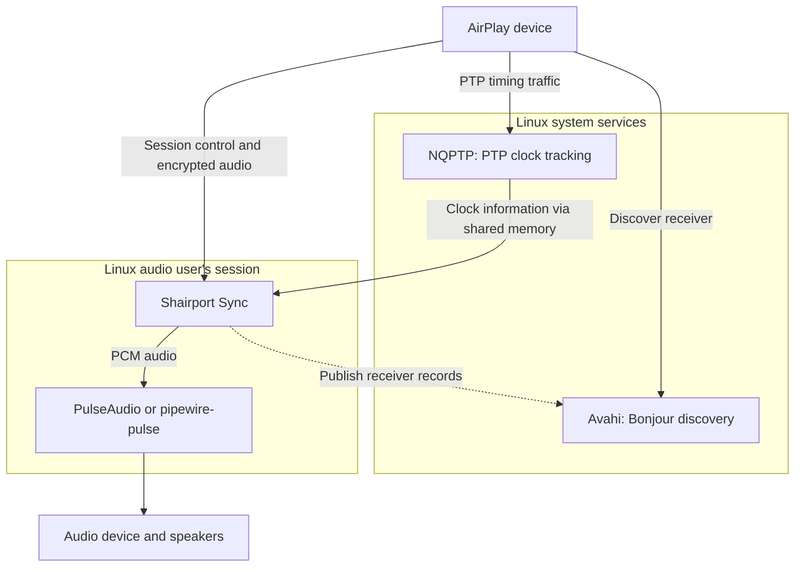
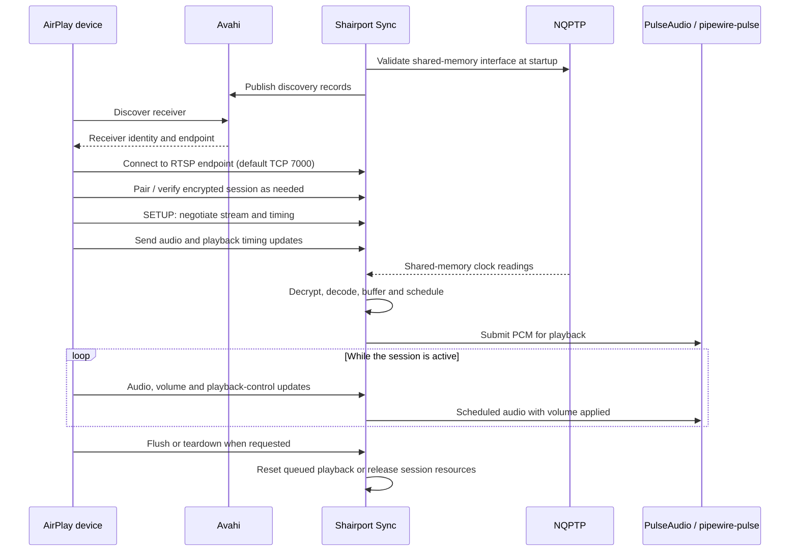
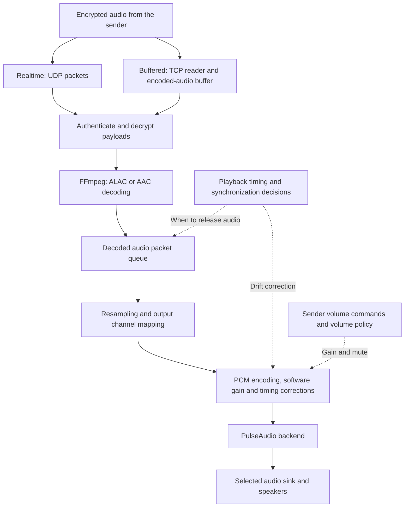
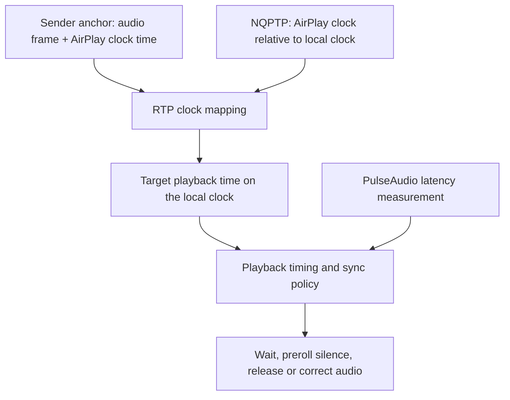

# Shairport Sync — AirPlay 2 receiver for Linux

Turn a Linux machine and its speakers into an AirPlay 2 audio destination.
Select the receiver on an AirPlay device; Shairport Sync receives the encrypted
stream, decodes it, schedules playback against the AirPlay clock and sends the
audio to your PulseAudio-compatible session.

This fork supports realtime and buffered playback, encrypted pairing, Home
integration and sender-controlled volume. It runs as a **systemd user service**
and works with PulseAudio or PipeWire's `pipewire-pulse` compatibility server.

The supported stack is Linux, AirPlay 2, PulseAudio, Avahi, NQPTP, OpenSSL and
FFmpeg. Receiver production code uses C++26; the bundled pairing dependency
remains C. AirPlay 1 and alternative audio or discovery backends are not
supported.

## Start here

- [How the services fit together](#how-the-services-fit-together)
- [From discovery to playback](#from-discovery-to-playback)
- [How audio reaches the speakers](#how-audio-reaches-the-speakers)
- [How playback stays synchronized](#how-playback-stays-synchronized)
- [Build and install](#build-and-install)
- [Configure and start](#configure-and-start)
- [Find your way around the source](#find-your-way-around-the-source)
- [Validation and troubleshooting](#validation-and-troubleshooting)

## How the services fit together

Shairport Sync handles the AirPlay session and playback. Three services provide
discovery, clock information and access to the audio device:



| Component | Responsibility |
| --- | --- |
| **Avahi** | Publishes Bonjour records so AirPlay devices can find the receiver. |
| **NQPTP** | Tracks the AirPlay PTP clock and exposes its relationship to the local clock through shared memory. |
| **Shairport Sync** | Pairs with senders, manages sessions, receives and decodes audio, controls volume and schedules playback. |
| **PulseAudio / pipewire-pulse** | Negotiates the output format and channel layout, queues PCM audio and routes it to a sink. |

Avahi and NQPTP must already be running as system services. Shairport Sync runs
as the user who owns the audio session. The user service installer starts the
receiver; it does not install or start those system services.

Avahi advertises `_airplay._tcp` and a complementary `_raop._tcp` record for
AirPlay 2 discovery. The RAOP record does not enable AirPlay 1 playback.

## From discovery to playback

Discovery makes the receiver visible. Session control then establishes the
encrypted connection, audio transport and timing information needed to play.
This is a conceptual flow; individual senders can vary the order and number of
protocol exchanges.



The RTSP handler supports setup, record, teardown, pairing and Home endpoints,
rate/anchor updates, flush operations and parameter handling. An **anchor**
connects an audio frame timestamp to a time on the shared AirPlay clock.
Volume commands update playback gain; a flush discards or resets affected
queued playback, while teardown releases the session.

To add the receiver to Home, use **Add Accessory → More Options**, then select
its advertised name. Keep the receiver name and device identifier stable.
See [ADDINGTOHOME.md](ADDINGTOHOME.md) for pairing guidance and device checks.

## How audio reaches the speakers

The sender chooses a stream type during setup. Both paths ultimately use the
same decoder, playback queue and PulseAudio output backend.

| Playback mode | Transport | Codec | Input format |
| --- | --- | --- | --- |
| Realtime | UDP audio packets | ALAC | 44.1 kHz / 16-bit stereo |
| Buffered | TCP buffered audio | ALAC | 48 kHz / 24-bit stereo |
| Buffered | TCP buffered audio | AAC | Stereo, 5.1 and 7.1 |



**Realtime playback** processes incoming packets and tracks sequence gaps.
Packet-buffer and retransmission logic can request missing packets while there
is still time to use them.

**Buffered playback** reads an encoded stream ahead over TCP. The buffered
processor uses playback timing to decide when to decrypt and pass blocks into
the player, and handles buffered flushes and timestamp discontinuities.

After decoding, audio waits in the packet queue until playback is due. The
player converts samples to the negotiated output rate and layout, applies
software volume and synchronization corrections, and submits PCM to the
backend. **PCM** is the uncompressed sample representation delivered to the
audio server; the input format does not guarantee the final hardware format.

## How playback stays synchronized

Packet arrival time is not playback time: network delay varies, and the audio
server already has samples queued. The receiver combines sender timestamps,
clock information and output latency to schedule playback:



1. **Translate the timeline.** RTP timestamps identify positions in the audio
   stream. Sender anchors and NQPTP clock information map those positions to
   local playback times.
2. **Account for queued output.** The backend reports latency, allowing
   playback timing to plan initial silence and release audio ahead of its
   intended audible time.
3. **Correct drift.** Playback synchronization compares expected frame timing
   with output-delay observations. It can adjust samples, insert silence or
   discard audio when resynchronization is needed. Tolerances and interpolation
   are configurable in the sample configuration.

NQPTP supplies clock information, not audio. It must expose **shared-memory
interface version 10**. Missing, inaccessible, uninitialized, truncated or
incompatible shared memory stops startup before the receiver listens or
advertises. Passing that startup check does not by itself establish an active
sender clock or good multiroom synchronization.

## Build and install

Use CMake **4.2 or newer**, Ninja, the pinned **Clang 23.1.3** toolchain in
[.tool-versions](.tool-versions), and **libstdc++ 15**. Test builds require
GoogleTest 1.17 or newer. Follow [BUILD.md](BUILD.md) to install the toolchain and
development dependencies before running these commands from the repository
root:

```sh
cmake -S . -B build/cmake -G Ninja \
  -DCMAKE_TOOLCHAIN_FILE=cmake/clang-toolchain.cmake \
  -DCMAKE_BUILD_TYPE=Release -DCMAKE_INSTALL_SYSCONFDIR=/etc
cmake --build build/cmake --parallel 2
ctest --test-dir build/cmake --output-on-failure
DESTDIR="$PWD/build/cmake/stage" cmake --install build/cmake
```

Inspect the staged binary, manual and configuration under
`build/cmake/stage` before installing on the host:

```sh
sudo cmake --install build/cmake
sudo cp --no-clobber /etc/shairport-sync.conf.sample /etc/shairport-sync.conf
```

These commands use the default `/usr/local` prefix and put the sample
configuration in `/etc`. If you choose another prefix, update the user service's
executable path before installing it.

## Configure and start

Edit `/etc/shairport-sync.conf`. Start with the
[sample configuration](scripts/shairport-sync.conf), which documents naming,
volume, synchronization, session and diagnostic settings.

- `general.name` sets the name shown to AirPlay devices; `%H` uses the hostname.
- `pulseaudio.server` selects the PulseAudio-compatible server.
- `pulseaudio.sink` selects an output sink; leaving it unset uses the default.
- `diagnostics.log_verbosity` and `diagnostics.statistics` enable more detail
  when investigating playback.

See [CONFIGURATION.md](CONFIGURATION.md) before migrating an older configuration:
legacy backend selectors and several upstream options have been removed.

Before starting, make sure NQPTP and Avahi are running and the current user has
a PulseAudio-compatible audio session. PipeWire users need `pipewire-pulse`.
The network must permit Bonjour discovery and negotiated AirPlay traffic;
the RTSP listener uses **TCP port 7000** by default, with additional audio and
control ports negotiated during setup.

As the user who owns the audio session, preview installation, then install and
start the service:

```sh
sh user-service-install.sh --dry-run
sh user-service-install.sh
systemctl --user status shairport-sync
journalctl --user -u shairport-sync
```

Do not run the installer as root. The installed unit launches
`/usr/local/bin/shairport-sync`, enables startup with the user's `default.target`
and restarts the receiver on failure. It does not configure system-wide
receiver startup independently of the user session.

Select the receiver in your device's AirPlay output picker and start playback.
After changing configuration, restart the receiver:

```sh
systemctl --user restart shairport-sync
```

## Find your way around the source

Production sources are grouped by responsibility under [`src/`](src).
Each package's `CMakeLists.txt` owns its source list. Root
[CMakeLists.txt](CMakeLists.txt) owns toolchain checks, dependencies, generated
files, tests and installation.

| Package | What it owns |
| --- | --- |
| [`src/app`](src/app) | Entrypoint, configuration and startup checks. |
| [`src/discovery`](src/discovery) | Bonjour records and Avahi registration. |
| [`src/protocol/rtsp`](src/protocol/rtsp) | Session-control requests, pairing endpoints and stream setup. |
| [`src/protocol/rtp`](src/protocol/rtp) | Realtime packet reception, control traffic and clock anchors. |
| [`src/protocol/ap2`](src/protocol/ap2) | Buffered audio processing and AirPlay 2 event handling. |
| [`src/session`](src/session) | Per-session state and session thread registration, retirement and shutdown. |
| [`src/audio`](src/audio) | Formats, channel mapping, decoding, buffering, resampling, PCM and output adapters. |
| [`src/packets`](src/packets) | Retransmission planning. |
| [`src/playback`](src/playback) | Player coordination, playback-thread lifecycle, timing, synchronization and statistics. |
| [`src/timing`](src/timing) | RTP clock mapping and NQPTP shared-memory access. |
| [`src/volume`](src/volume) | Volume policy, session volume state and runtime effects. |
| [`src/monitoring`](src/monitoring) | Receiver activity state and monitoring. |
| [`src/runtime`](src/runtime), [`src/platform/utilities`](src/platform/utilities) | Shared runtime support and platform/protocol utilities. |
| [`pair_ap`](pair_ap) | Bundled C pairing implementation. |

Packets, audio formats, PCM, playback timing, volume policy, RTP clocks and text
formatting have separate library targets. Other packages contribute to the
shared `receiver` target. This lets isolated tests build without relinking
unrelated receiver components; see [BUILD.md](BUILD.md#build-checks) for targeted
CTest commands.

## Validation and troubleshooting

[CI](.github/workflows/receiver.yml) builds Release, Debug, ASan+UBSan and TSan
configurations, runs CTest contracts and checks staged installation. Tests cover
decoding, buffering, timing, volume, session lifecycle, RTSP handling and startup
validation. [VALIDATION.md](VALIDATION.md) records coverage and reproducible
device checks.

Automated tests do not establish playback quality or multiroom timing. Actual
AirPlay devices are needed to validate playback, pairing, reconnect and Home
integration end to end.

| Symptom | First checks |
| --- | --- |
| Receiver fails before becoming visible | Read the user-service log; check NQPTP availability and shared-memory compatibility. |
| Service runs but receiver is absent from the picker | Check Avahi, receiver naming and whether the network permits Bonjour discovery. |
| Receiver connects but produces no sound | Check the audio user's PulseAudio / `pipewire-pulse` session and the configured server and sink. |
| Dropouts or timing problems | Enable diagnostics; check packet loss, clock information and output latency. |
| Pairing or Home problems | Follow [ADDINGTOHOME.md](ADDINGTOHOME.md) and inspect receiver logs. |

See [TROUBLESHOOTING.md](TROUBLESHOOTING.md) for further diagnostics and
[AIRPLAY2.md](AIRPLAY2.md) for protocol details.

## Documentation and licenses

- [BUILD.md](BUILD.md): dependencies, installation, targeted tests and sanitizer builds.
- [CONFIGURATION.md](CONFIGURATION.md): build options and configuration migration.
- [AIRPLAY2.md](AIRPLAY2.md): supported protocol behavior and stream formats.
- [ADDINGTOHOME.md](ADDINGTOHOME.md): Home pairing and device checks.
- [TROUBLESHOOTING.md](TROUBLESHOOTING.md): diagnostic guidance.
- [VALIDATION.md](VALIDATION.md): test coverage, evidence and verification limits.

All project documentation, code comments, commit messages and pull requests
must be written in English. The diagrams use Mermaid, which GitHub renders
directly in this README.

Licenses are listed in [LICENSES](LICENSES) and the source files.
[RELEASENOTES.md](RELEASENOTES.md) contains upstream release history.
